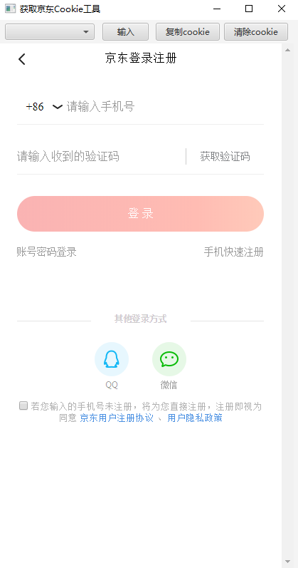

# 获取京东cookie工具

## 说明

本程序只是简化了打开手机版网页、输入手机号、获取cookie步骤，并不能一键扫码登录获取。

## 编译步骤

1. 下载代码：`git clone https://github.com/XanderYe/jd-cookie.git`
2. 自行将 `jxbrowser` 安装到maven本地仓库，如linux或mac需要修改依赖。
3. 执行命令打包：`mvn -Dmaven.test.skip=true clean package`
4. 提取生成的jar包 `jd-cookie-1.0-SNAPSHOT-assembly.jar`
5. 复制项目根目录的 `config.properties`，修改 `phone.numbers` 为常用账号手机号
6. 压缩软件打开 `jd-cookie-1.0-SNAPSHOT-assembly.jar`，移动lib到同目录下，修改目录结构为
```
.
|--config.properties
|--jd-cookie-1.0-SNAPSHOT-assembly.jar  13KB
|
|--lib
| |--jd-cookie-1.0-SNAPSHOT.jar
| |--jxbrowser-6.21.jar
| |--jxbrowser-win32-6.21.jar
| |--log4j-api-2.14.0.jar
| |--log4j-core-2.14.0.jar
| |--log4j-slf4j-impl-2.14.0.jar
| |--slf4j-api-1.7.25.jar
```
7. 双击运行`jd-cookie-1.0-SNAPSHOT-assembly.jar`，或使用命令运行：`java -jar jd-cookie-1.0-SNAPSHOT-assembly.jar`

## 界面展示

